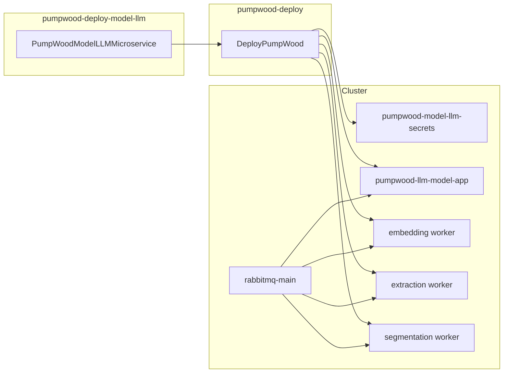

# pumpwood-deploy-model-llm

Satellite deploy package for the **Pumpwood Model LLM** microservice on
Kubernetes. It generates manifests for the API application, three LLM
workers (embedding, extraction, segmentation), and model-llm secrets —
then hands them to
[`pumpwood-deploy`](https://github.com/Murabei-OpenSource-Codes/pumpwood-deploy)
for apply.

Developed by [Murabei Data Science](https://murabei.com). BSD-3-Clause.

---

## What it deploys

| Manifest | Kubernetes resources |
|----------|----------------------|
| `pumpwood_model_llm__secrets` | Secret `pumpwood-model-llm-secrets` |
| `pumpwood_model_llm__deploy` | Deployment + Service `pumpwood-llm-model-app` |
| `pumpwood_llm_model_embedding_worker` | Deployment `pumpwood-llm-model-embedding-worker` |
| `pumpwood_llm_model_extraction_worker` | Deployment `pumpwood-llm-model-extraction-worker` |
| `pumpwood_llm_model_segmentation_worker` | Deployment `pumpwood-llm-model-segmentation-worker` |

Model LLM exposes HTTP APIs for large-language-model workflows. Workers
consume RabbitMQ messages for embedding, extraction, and segmentation
tasks.



---

## Prerequisites

This package does **not** stand alone. Before model-llm pods can start,
the cluster must already provide:

| Resource | Provided by |
|----------|-------------|
| `storage` ConfigMap | `StandardMicroservices` in `pumpwood-deploy` |
| `general-secrets` | `StandardMicroservices` |
| `rabbitmq-main-secrets` | `StandardMicroservices` |
| Storage keys (GCP / Azure / AWS) | `DeployPumpWood` storage config |
| Postgres for model llm | `PostgresDatabase` + `PGBouncerDatabase` |
| Auth (typical) | [`pumpwood-deploy-auth`](https://github.com/Murabei-OpenSource-Codes/pumpwood-deploy-auth) |

Storage bucket name and type are read from the cluster `storage`
ConfigMap — they are **not** passed to `PumpWoodModelLLMMicroservice`.

---

## Installation

```bash
pip install pumpwood-deploy-model-llm
```

Requires `pumpwood-deploy`.

---

## Quick start

```python
import os
import simplejson as json
from dotenv import load_dotenv
from pumpwood_deploy.deploy import DeployPumpWood
from pumpwood_deploy.microservices.postgres.deploy import (
    PostgresDatabase, PGBouncerDatabase)
from pumpwood_deploy_model_llm import PumpWoodModelLLMMicroservice

with open("secrets/production.json", "r") as file:
    secrets = json.loads(file.read())
load_dotenv()

deploy = DeployPumpWood(
    model_user_password=secrets["microservices--model"],
    rabbitmq_secret=secrets["rabbitmq_secret"],
    hash_salt=secrets["hash_salt"],
    storage_type="aws_s3",
    storage_deploy_args={
        "storage_bucket_name": "my-pumpwood-bucket",
        "access_key_id": secrets["aws_access_key_id"],
        "secret_access_key": secrets["aws_secret_access_key"],
    },
    k8_provider="aws",
    k8_deploy_args={
        "region": "us-east-1",
        "cluster_name": "my-cluster",
    },
    k8_namespace="pumpwood",
)

deploy.add_microservice(
    PostgresDatabase(
        db_username="pumpwood",
        db_password=secrets["postgres_password"],
        name="postgres-main",
        disk_name="postgres-disk",
        disk_size="150Gi",
    ))

deploy.add_microservice(
    PGBouncerDatabase(
        name="pgbouncer-pumpwood-model-llm",
        postgres_database="pumpwood_model_llm",
        postgres_secret="postgres-main",
        postgres_host="postgres-main",
    ))

deploy.add_microservice(
    PumpWoodModelLLMMicroservice(
        app_version=os.getenv("PUMPWOOD_MODEL_LLM_APP"),
        worker_embedding_version=os.getenv("PUMPWOOD_MODEL_LLM_EMBEDDING"),
        worker_extraction_version=os.getenv("PUMPWOOD_MODEL_LLM_EXTRACTION"),
        worker_segmentation_version=os.getenv(
            "PUMPWOOD_MODEL_LLM_SEGMENTATION"),
        repository="my-registry.example.com",
        db_host="pgbouncer-pumpwood-model-llm",
        db_database="pumpwood_model_llm",
        db_password=secrets["postgres_password"],
        microservice_password=secrets["microservice--model-llm"],
    ))

deploy.create_deploy_files()
deploy.deploy_microservices()
```

### Environment variables

```bash
PUMPWOOD_MODEL_LLM_APP=2.1.0
PUMPWOOD_MODEL_LLM_EMBEDDING=1.4.0
PUMPWOOD_MODEL_LLM_EXTRACTION=1.4.0
PUMPWOOD_MODEL_LLM_SEGMENTATION=1.4.0
```

If the rendered manifest matches what is already on the cluster, `kubectl
apply` produces no changes — safe for rolling image updates.

---

## Configuration reference

### Required

| Parameter | Description |
|-----------|-------------|
| `app_version` | Image tag for `pumpwood-llm-model-app` |
| `worker_embedding_version` | Image tag for embedding worker |
| `worker_extraction_version` | Image tag for extraction worker |
| `worker_segmentation_version` | Image tag for segmentation worker |

### Database

| Parameter | Default | Description |
|-----------|---------|-------------|
| `db_host` | `pgbouncer-pumpwood-model-llm` | Postgres host |
| `db_port` | `5432` | Postgres port |
| `db_database` | `pumpwood` | Database name |
| `db_username` | `pumpwood` | Database user |
| `db_password` | `pumpwood` | Database password |
| `microservice_password` | `microservice--model-llm` | Service user password |
| `repository` | GCR default | Docker registry |

### Application

| Parameter | Default | Description |
|-----------|---------|-------------|
| `app_replicas` | `1` | App pod count |
| `app_debug` | `FALSE` | Debug flag |
| `app_workers` | `10` | Granian workers |
| `app_timeout` | `300` | Request timeout (seconds) |
| `app_limits_memory` | `60Gi` | Memory limit |
| `app_limits_cpu` | `12000m` | CPU limit |

Each worker (`worker_embedding_*`, `worker_extraction_*`,
`worker_segmentation_*`) supports `debug`, `replicas`, `n_parallel`,
`chunk_size`, `query_limit`, and resource limit/request parameters with
defaults matching the datalake dataloader pattern.

---

## Health check

The app Deployment exposes a readiness probe at:

```
GET /health-check/pumpwood-llm-model-app/  (port 5000)
```

---

## Migration note

This is a new satellite package. Import from:

```python
from pumpwood_deploy_model_llm import PumpWoodModelLLMMicroservice
```

---

## Related packages

| Package | Role |
|---------|------|
| [`pumpwood-deploy`](https://github.com/Murabei-OpenSource-Codes/pumpwood-deploy) | Orchestrator, Kong, RabbitMQ, Postgres |
| [`pumpwood-deploy-auth`](https://github.com/Murabei-OpenSource-Codes/pumpwood-deploy-auth) | Authorization microservice |
| [`pumpwood-deploy-datalake`](https://github.com/Murabei-OpenSource-Codes/pumpwood-deploy-datalake) | Standard datalake |

---

## Development

```bash
pip install -e ../pumpwood-deploy
pip install -e .

PYTHONPATH="src:../pumpwood-deploy/src" \
  python3 -m unittest discover \
  -s src/pumpwood_deploy_model_llm/tests -p "test_*.py" -v

ruff check src/
```

---

## License

BSD-3-Clause — see [LICENSE](LICENSE).
